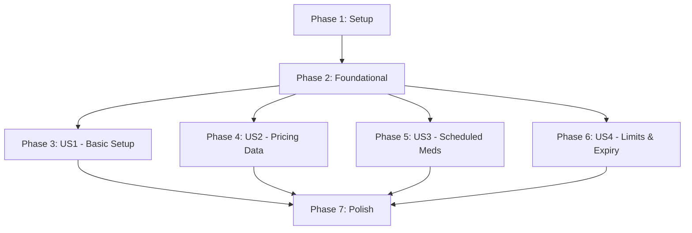

# Tasks: Phase 1 Product Management Security

**Input**: Design documents from `specs/001-phase1-product-security/`
**Prerequisites**: plan.md (required), spec.md (required for user stories), research.md, data-model.md, quickstart.md

**Organization**: Tasks are grouped by user story to enable independent implementation and testing of each story.

## Format: `[ID] [P?] [Story] Description`

- **[P]**: Can run in parallel (different files, no dependencies)
- **[Story]**: Which user story this task belongs to (e.g., US1, US2, US3, US4)
- Include exact file paths in descriptions

---

## Phase 1: Setup (Shared Infrastructure)

**Purpose**: Project initialization and manifest alignment across all modules.

- [X] T001 Verify/Update all 9 standard roles exist in `pharmacy_base/security/security.xml`
- [X] T002 [P] Update `__manifest__.py` in `pharmacy_inventory_advanced` to depend on `pharmacy_base`
- [X] T003 [P] Update `__manifest__.py` in `pharmacy_inventory_ops` to depend on `pharmacy_base`
- [X] T004 [P] Update `__manifest__.py` in `pharmacy_pos` to depend on `pharmacy_base`
- [X] T005 [P] Update `__manifest__.py` in `pharmacy_purchase` to depend on `pharmacy_base`
- [X] T006 [P] Update `__manifest__.py` in `pharmacy_reports` to depend on `pharmacy_base`
- [X] T007 [P] Update `__manifest__.py` in `pharmacy_sales_rules` to depend on `pharmacy_base`
- [X] T008 [P] Update `__manifest__.py` in `pharmacy_stock_expiry` to depend on `pharmacy_base`
- [X] T009 [P] Update `__manifest__.py` in `pharmacy_stock_reservation` to depend on `pharmacy_base`
- [X] T010 [P] Update `__manifest__.py` in `pharmacy_system` to depend on `pharmacy_base`
- [X] T011 [P] Update `__manifest__.py` in `pharmacy_wishlist` to depend on `pharmacy_base`

---

## Phase 2: Foundational (Blocking Prerequisites)

**Purpose**: Core infrastructure that MUST be complete before ANY user story can be implemented.

- [X] T012 Create `pharmacy.audit.log` model in `pharmacy_base/models/audit_log.py`
- [X] T013 Setup restrictive ACL for `pharmacy.audit.log` in `pharmacy_base/security/ir.model.access.csv`
- [X] T014 Add view for Audit Log in `pharmacy_base/views/audit_log_views.xml` and include in `__manifest__.py`

**Checkpoint**: Foundation ready - user story implementation can now begin.

---

## Phase 3: User Story 1 - Secure Basic Product Setup (Priority: P1) 🎯 MVP

**Goal**: Restrict core product fields, barcodes, and categories to Product Configuration Manager / Pharmacy Manager.

**Independent Test**: Login as a Cashier and verify that product names and categories are read-only. Verify barcode creation is restricted.

### Implementation for User Story 1

- [X] T015 [US1] Update `pharmacy_base/security/ir.model.access.csv` to restrict create/write/unlink on `product.template` to Product Configuration / Pharmacy Manager.
- [X] T016 [US1] Update `pharmacy_base/security/ir.model.access.csv` to restrict create/write/unlink on `product.product` to Product Configuration / Pharmacy Manager.
- [X] T017 [US1] Update `pharmacy_base/security/ir.model.access.csv` to restrict `product.barcode.line` to Product Configuration / Inventory / Pharmacy Manager.
- [X] T018 [US1] Override `write` in `pharmacy_base/models/product_template.py` to enforce category editing restrictions.
- [X] T019 [US1] Override `write` in `pharmacy_base/models/product_template.py` to log classification changes in `pharmacy.audit.log`.

**Checkpoint**: User Story 1 functional and testable.

---

## Phase 4: User Story 2 - Secure Sensitive Product Data (Priority: P1)

**Goal**: Hide and restrict cost prices, commissions, and government price locks from unauthorized staff.

**Independent Test**: Login as a Cashier and verify `standard_price` and `commission_pct` are invisible in both UI and via RPC.

### Implementation for User Story 2

- [X] T020 [P] [US2] Update `pharmacy_base/models/product_template.py` adding `groups` attribute to `standard_price`.
- [ ] T021 [P] [US2] Update `pharmacy_base/models/product_template.py` adding `groups` attribute to `pharmacist_price`. (Field not found in current codebase, skipped)
- [X] T022 [P] [US2] Update `pharmacy_base/models/product_template.py` adding `groups` attribute to `commission_pct`.
- [X] T023 [US2] Update `pharmacy_base/models/product_template.py` adding `groups` attribute to `government_price_lock`.
- [X] T024 [US2] Update views in `pharmacy_base/views/product_views.xml` to set field groups for pricing data.
- [X] T025 [US2] Override `write` in `pharmacy_base/models/product_template.py` to log `government_price_lock` changes.

**Checkpoint**: User Stories 1 & 2 complete.

---

## Phase 5: User Story 3 - Secure Regulated Medicines (Priority: P1)

**Goal**: Restrict scheduled medicine level changes to Pharmacists/Managers and log immutably.

**Independent Test**: Verify that schedule level changes trigger audit logs and are blocked for Inventory Managers.

### Implementation for User Story 3

- [X] T026 [US3] Update `pharmacy_base/models/product_template.py` adding `groups` to `is_scheduled_medicine` and `schedule_level`.
- [X] T027 [US3] Override `write` in `pharmacy_base/models/product_template.py` to trigger `pharmacy.audit.log` on schedule changes.

**Checkpoint**: Priority 1 stories (US1-US3) functional.

---

## Phase 6: User Story 4 - Secure Inventory Limits and Expiry (Priority: P2)

**Goal**: Restrict tracking method changes, max qty limits, and low-stock overrides.

**Independent Test**: Verify tracking changes are blocked if stock moves exist. Verify max qty limits enforce logging on override.

### Implementation for User Story 4

- [X] T028 [US4] Update `pharmacy_base/models/product_template.py` adding `groups` to `max_qty_per_invoice` and `low_stock_limit`.
- [X] T029 [US4] Override `write` in `pharmacy_base/models/product_template.py` to block `tracking` field changes if stock moves exist.
- [X] T030 [US4] Implement `max_qty_per_invoice` validation in `pharmacy_sales_rules/models/sale_order_line.py`.
- [X] T031 [US4] Implement `max_qty_per_invoice` validation in `pharmacy_pos/models/pos_order_line.py`.
- [X] T032 [US4] Audit and scope `sudo()` in `pharmacy_stock_expiry/models/stock_production_lot.py` cron job.

**Checkpoint**: All user stories functional.

---

## Phase 7: Polish & Cross-Cutting Concerns

**Purpose**: Security hardening across modules and report restrictions.

- [X] T033 [P] Audit and fix `ir.model.access.csv` in `pharmacy_inventory_advanced/security/`.
- [X] T034 [P] Audit and fix `ir.model.access.csv` in `pharmacy_inventory_ops/security/`.
- [X] T035 [P] Audit and fix `ir.model.access.csv` in `pharmacy_reports/security/`.
- [X] T036 [P] Review and refactor un-scoped `sudo()` in `pharmacy_inventory_ops/models/` case-by-case (do not automatically replace with `with_user()`).
- [X] T037 [US2] Restrict margin/commission reports in `pharmacy_reports/views/` to Pricing/Pharmacy Managers.
- [X] T038 Run quickstart.md validation as each role.

---

## Phase 8: Additional Security Hardening & Negative Tests

**Purpose**: Ensure no sensitive data leaks through advanced Odoo mechanisms and validate system boundaries.

- [ ] T039 Audit all product-related export actions and XLS/PDF reports for sensitive field leakage including `standard_price`, `pharmacist_price`, `commission_pct`, and price history fields in `pharmacy_reports/`.
- [ ] T040 Audit all product-related `search_read`, `read_group`, `name_search`, RPC, and POS payload paths for restricted field leakage in `pharmacy_base/` and `pharmacy_pos/`.
- [ ] T041 Add explicit backend `has_group()` validation for government price lock override in `pharmacy_base/models/product_template.py`.
- [ ] T042 Add explicit backend `has_group()` validation for scheduled medicine updates in `pharmacy_base/models/product_template.py`.
- [ ] T043 Add explicit backend `has_group()` validation for low-stock override workflows in `pharmacy_sales_rules/` and `pharmacy_pos/`.
- [ ] T044 Add explicit backend `has_group()` validation for max quantity override workflows in `pharmacy_sales_rules/` and `pharmacy_pos/`.
- [ ] T045 Add explicit backend `has_group()` validation for duplicate/shared barcode approval workflows in `pharmacy_base/`.
- [ ] T046 Make `pharmacy.audit.log` immutable after create by preventing normal write/unlink access in `pharmacy_base/models/audit_log.py`.
- [ ] T047 Audit all Phase 1 transient models/wizards and add missing ACL restrictions in `ir.model.access.csv`.
- [ ] T048 Audit all product-related menus, actions, and server actions for missing group restrictions in `views/` and `data/`.
- [ ] T049 Review `sudo()` usage case-by-case instead of automatically replacing with `with_user()` across Phase 1 modules.
- [ ] T050 Add negative tests for direct RPC/API bypass attempts on restricted product fields and overrides.
- [ ] T051 Add negative tests for unauthorized export/report access attempts.
- [ ] T052 Add validation that Cashier and Technician roles cannot access cost, commission, or sensitive pricing data through UI, RPC, exports, reports, or POS payloads.

---

## Dependencies & Execution Order

### Dependency Graph



*Note: US1, US2, and US3 all modify `product_template.py` and can be implemented in any order once Foundation is ready, though sequential order (US1 -> US2 -> US3) is recommended to avoid git conflicts in the same file.*

### Parallel Execution Examples per Story

**Phase 1 (Setup)**:
```bash
# Parallel manifest updates:
- T002 Update advanced manifest
- T003 Update ops manifest
- T004 Update pos manifest
```

**User Story 2**:
```bash
# Parallel field level security:
- T020 standard_price
- T021 pharmacist_price
- T022 commission_pct
```

**Polish Phase**:
```bash
# Parallel ACL audits:
- T033 inventory_advanced ACL
- T034 inventory_ops ACL
- T035 reports ACL
```

---

## Implementation Strategy

### MVP First (User Story 1 Only)

1. **Complete Phase 1 & 2**: Establish manifest dependencies and the Audit Log framework.
2. **Implement User Story 1**: Focus strictly on `ir.model.access.csv` and core field write overrides.
3. **Validate**: Test with a Cashier user. This provides the first "win" by securing the most critical product data fields.

### Incremental Delivery

1. Foundation ready.
2. US1 (Core Security) delivered.
3. US2 (Pricing Privacy) delivered.
4. US3 (Compliance/Regulated) delivered.
5. US4 (Inventory Operations) delivered.
6. Final Polish and Hardening.

---

## Notes
- [P] tasks indicate different files or independent logic.
- Each User Story phase is designed to be an independently testable increment of value.
- The `pharmacy_base` module remains the single source of truth for group definitions.
