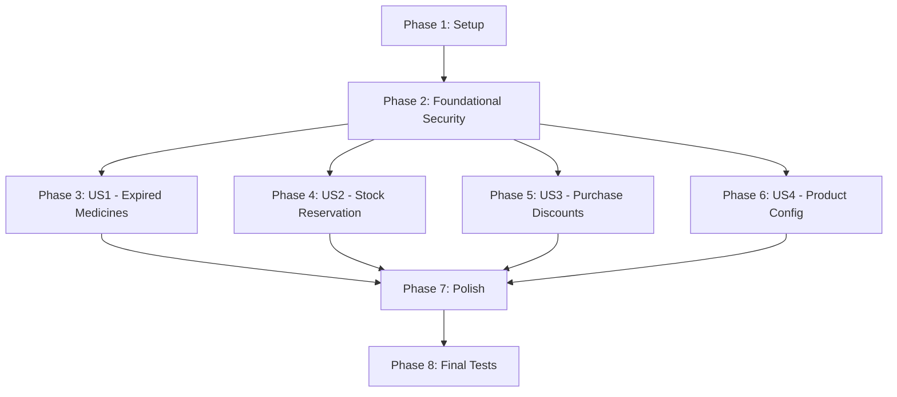

# Tasks: Phase 2 Security Hardening

**Branch**: `[###-feature-name]`
**Input**: Design documents from `specs/002-phase2-security/`
**Prerequisites**: plan.md, spec.md, research.md, data-model.md, quickstart.md

---

## Phase 1: Setup & Audits (Shared Infrastructure)

**Purpose**: Initial audits and manifest verification.

- [X] PH2-AUD-001 [P] List all Phase 2 custom models and transient models across all modules.
- [X] PH2-AUD-002 [P] List all ACL entries and detect empty `group_id` ACLs in Phase 2 modules.
- [X] PH2-AUD-003 [P] Detect unsafe `base.group_user` ACLs in Phase 2 modules.
- [X] PH2-AUD-004 [P] Detect all menus, actions, and reports without groups.
- [X] PH2-AUD-005 [P] Detect all server actions, buttons, controller routes, and POS RPC methods.
- [X] PH2-AUD-006 [P] Detect all `sudo()` usages in Phase 2 modules.
- [X] PH2-AUD-007 [P] Detect restricted model relations loaded on allowed pages that may cause AccessError.
- [X] PH2-MAN-001 [P] Verify `pharmacy_inventory_advanced` depends on `pharmacy_base` and security files load first.
- [X] PH2-MAN-002 [P] Verify `pharmacy_inventory_ops` depends on `pharmacy_base` and security files load first.
- [X] PH2-MAN-003 [P] Verify `pharmacy_pos` depends on `pharmacy_base` and security files load first.
- [X] PH2-MAN-004 [P] Verify `pharmacy_purchase` depends on `pharmacy_base` and security files load first.
- [X] PH2-MAN-005 [P] Verify `pharmacy_reports` depends on `pharmacy_base` and its `ir.model.access.csv` is loaded.
- [X] PH2-MAN-006 [P] Verify `pharmacy_sales_rules` depends on `pharmacy_base` and security files load first.
- [X] PH2-MAN-007 [P] Verify `pharmacy_stock_expiry` depends on `pharmacy_base` and security files load first.
- [X] PH2-MAN-008 [P] Verify `pharmacy_stock_reservation` depends on `pharmacy_base` and security files load first.
- [X] PH2-MAN-009 [P] Verify `pharmacy_system` depends on `pharmacy_base` and security files load first.
- [X] PH2-MAN-010 [P] Verify `pharmacy_wishlist` depends on `pharmacy_base` and security files load first.

---

## Phase 2: Foundational Security (Blocking Prerequisites)

**Purpose**: Core ACLs, Record Rules, Field Visibility, and Sudo Reviews that apply across all use cases.

### ACL Tasks
- [X] PH2-ACL-001 [P] Create ACL corrections for last purchase discount/history models.
- [X] PH2-ACL-002 [P] Create ACL corrections for shared barcode and related product models.
- [X] PH2-ACL-003 [P] Create ACL corrections for expired medicines/page/helper models and settings/wizards.
- [X] PH2-ACL-004 [P] Create ACL corrections for consignment tracking/payment and purchase import helper models.
- [X] PH2-ACL-005 [P] Create ACL corrections for PO tracking, stock reservation helpers, inventory count models.
- [X] PH2-ACL-006 [P] Create ACL corrections for bulk scrap, lines, and forecast/consumption report models.
- [X] PH2-ACL-007 [P] Create ACL corrections for shortage list and wishlist models and lines.
- [X] PH2-ACL-008 [P] Audit and restrict all transient wizards.

### Record Rule Tasks
- [X] PH2-RULE-001 [P] Implement record rules for expired medicine data by company/location/branch and reports.
- [X] PH2-RULE-002 [P] Implement record rules for shortage list by location/branch and wishlist by shop/location/company.
- [X] PH2-RULE-003 [P] Implement record rules for bulk scrap sessions by location/company.
- [X] PH2-RULE-004 [P] Implement record rules for consignment records by company/vendor/branch.
- [X] PH2-RULE-005 [P] Implement record rules for inventory count and reservation helpers by location/company.
- [X] PH2-RULE-006 [P] Implement record rules for reports stored as models if any.

### Field Visibility & Menu Tasks
- [X] PH2-FIELD-001 [P] Protect `last purchase discount`, `discount history`, `supplier discount fields`.
- [X] PH2-FIELD-002 [P] Protect `box price` and `total value` in expired report.
- [X] PH2-FIELD-003 [P] Protect `consignment payment quantities/history`, `forecast/order cost data`.
- [X] PH2-FIELD-004 [P] Protect `customer phone/private wishlist data` where appropriate.
- [X] PH2-REP-001 [P] Restrict all sensitive menus, actions, reports, and export buttons (e.g. Expired Medicines Page/Report, Run Expiry Detection, Shared Barcodes Report, etc.).

### Sudo Review Tasks
- [X] PH2-SUDO-001 [P] Review `sudo()` case-by-case in `pharmacy_stock_expiry` and `pharmacy_stock_reservation`. Add pre-checks for user actions.
- [X] PH2-SUDO-002 [P] Review `sudo()` case-by-case in `pharmacy_wishlist` and `pharmacy_purchase`. Add pre-checks for user actions.
- [X] PH2-SUDO-003 [P] Review `sudo()` case-by-case in `pharmacy_inventory_advanced`, `pharmacy_inventory_ops`, `pharmacy_reports`, and `pharmacy_pos`. Add pre-checks for user actions.

---

## Phase 3: User Story 1 - Expired Medicines Handling (Priority: P1)

**Goal**: Implement and verify security coverage for Expired Medicines use cases.

- [X] PH2-UC-001 [US1] Create UC coverage checklist for SC2-UC-01 (Expired Location Type) verifying ACL, rules, fields, backend checks, sudo, and positive/negative tests.
- [X] PH2-UC-002 [US1] Create UC coverage checklist for SC2-UC-02 (MM/YYYY Expiry Input).
- [X] PH2-UC-003 [US1] Create UC coverage checklist for SC2-UC-03 (Near-Expiry Alerts).
- [X] PH2-UC-004 [US1] Create UC coverage checklist for SC2-UC-04 (Expired Lot Detection) and implement backend `has_group()` for run expiry detection.
- [X] PH2-UC-005 [US1] Create UC coverage checklist for SC2-UC-05 (Expired Medicines Page) and implement backend `has_group()` for transfer selected expired medicines.
- [X] PH2-UC-006 [US1] Create UC coverage checklist for SC2-UC-06 (Expired Medicines Report) and implement backend `has_group()` for export PDF/Excel.

---

## Phase 4: User Story 2 - Stock Reservation & Inventory Count (Priority: P1)

**Goal**: Implement and verify security coverage for Stock Reservation and Inventory Count use cases.

- [X] PH2-UC-007 [US2] Create UC coverage checklist for SC4-UC-01 (Stock Reservation & Transfer Locking) and implement backend `has_group()` for force unreserve.
- [X] PH2-UC-008 [US2] Create UC coverage checklist for SC4-UC-02 (Inventory Adjustment Daily & Periodic Count) and implement backend `has_group()` for validate periodic count.
- [X] PH2-UC-009 [US2] Create UC coverage checklist for SC4-UC-03 (Bulk Scrap) and implement backend `has_group()` for validate bulk scrap.
- [X] PH2-UC-010 [US2] Create UC coverage checklist for SC4-UC-04 (Forecast & Consumption Comparison) and implement backend `has_group()` for create PO from forecast.
- [X] PH2-UC-011 [US2] Create UC coverage checklist for SC4-UC-05 (Reorder Threshold & Shortage List) and implement backend `has_group()` for create PO/manually remove shortage.

---

## Phase 5: User Story 3 - Purchase Discounts & Import (Priority: P2)

**Goal**: Implement and verify security coverage for Purchase Discounts, Consignment, and PO Tracking.

- [X] PH2-UC-012 [US3] Create UC coverage checklist for SC1-UC-01 (Last Purchase Discount).
- [X] PH2-UC-013 [US3] Create UC coverage checklist for SC3-UC-01 (Import Purchase Order Lines from Excel) and implement backend `has_group()` for import purchase order lines.
- [X] PH2-UC-014 [US3] Create UC coverage checklist for SC3-UC-02 (Consignment Purchase) and implement backend `has_group()` for consignment Track Stock wizard and payment/vendor bill creation.
- [X] PH2-UC-015 [US3] Create UC coverage checklist for SC3-UC-03 (Purchase Order Tracking).

---

## Phase 6: User Story 4 - Product Configuration & Wishlist (Priority: P2)

**Goal**: Implement and verify security coverage for Product Config and Wishlist.

- [X] PH2-UC-016 [US4] Create UC coverage checklist for SC1-UC-02 (Shared Barcode), ensure POS shared barcode dialog is read-only, and implement backend `has_group()` for duplicate approval.
- [X] PH2-UC-017 [US4] Create UC coverage checklist for SC1-UC-03 (Similar & Complementary Products), ensure POS suggestions panel is read-only, and implement backend `has_group()` for reciprocal related product.
- [X] PH2-UC-018 [US4] Create UC coverage checklist for SC5-UC-01 (Wishlist), ensure POS wishlist create permission checks backend, and implement backend `has_group()` for wishlist create, CALL CUSTOMER, and CALL-NOT ANSWER.

---

---

## Phase 7: Polish & Cross-Cutting Concerns

**Purpose**: POS payload protection and final validation.

- [X] PH2-POS-001 [P] Ensure POS payload must not leak restricted cost/discount fields.
- [X] PH2-POS-002 [P] Ensure expired lot warning override is logged in POS.
- [X] PH2-POS-003 [P] Ensure Cashier must not trigger AccessError by hidden restricted relations.
- [X] PH2-POS-004 [P] Ensure One2many/stat button compute methods referencing restricted models return safe defaults for unauthorized users instead of triggering AccessError.
- [X] PH2-POS-005 [P] Audit search_count and compute methods using restricted models and guard them with has_group() before reading protected records.
- [X] PH2-REP-002 [P] Audit export_data and custom XLS/PDF export methods for hidden restricted field leakage.

---

## Phase 8: Final Test Tasks

**Purpose**: Execute role testing and negative testing to validate the security hardening.

- [X] PH2-TEST-001 Update/install modules successfully and validate no XML/CSV errors.
- [X] PH2-TEST-002 Test Cashier role.
- [X] PH2-TEST-003 Test Technician role.
- [X] PH2-TEST-004 Test Pharmacist role.
- [X] PH2-TEST-005 Test Inventory Manager role.
- [X] PH2-TEST-006 Test Purchasing Officer role.
- [X] PH2-TEST-007 Test Pricing Manager role.
- [X] PH2-TEST-008 Test Product Configuration Manager role.
- [X] PH2-TEST-009 Test Pharmacy Manager role.
- [X] PH2-TEST-010 Test Multi-Branch Manager role.
- [X] PH2-TEST-011 Test Compliance Manager role.
- [X] PH2-TEST-012 Test branch/location isolation.
- [X] PH2-TEST-013 Test direct RPC/API bypass attempts.
- [X] PH2-TEST-014 Test unauthorized exports/reports.
- [X] PH2-TEST-015 Test POS payload leakage.
- [X] PH2-TEST-016 Test no unintended empty ACL remains.
- [X] PH2-TEST-017 Test no allowed page crashes because of restricted hidden model access.

---

## Dependencies & Execution Order

### Dependency Graph

### Implementation Strategy
1. Perform audits and manifest checks (Phase 1).
2. Establish core ACLs, Rules, and Field level security (Phase 2).
3. Validate use case coverages iteratively across Phase 3-6.
4. Polish POS and related cross-cutting concerns (Phase 7).
5. Run full negative and positive testing suite (Phase 8).